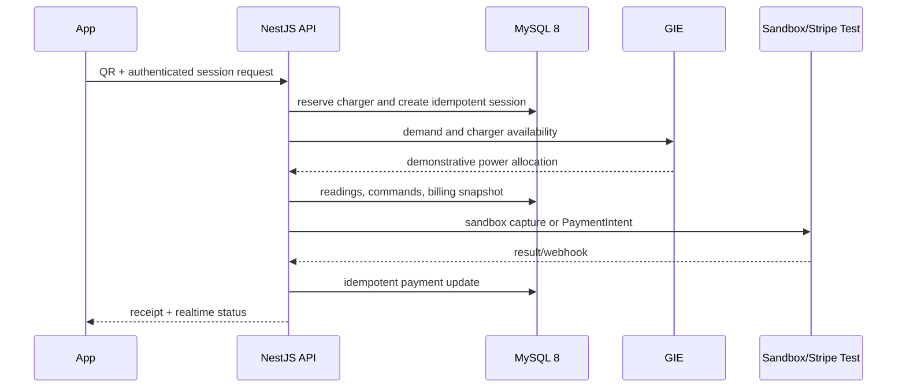

# Architecture

EMPS uses one API as the authority for identity, charging sessions, tariffs, frozen billing, payments and realtime state.

The Next.js Site uses the same API for administration and operations. MySQL stores the official 20-table model. Prisma maps application models to that schema. Historical sessions without a tariff version or billing snapshot remain legacy records and are not recalculated automatically.

GIE is a separate Python service. Its NORMAL mode feeds the existing runtime with demonstrative telemetry, session demand and weather when available; deterministic fallback keeps the demo reproducible. Presentation and Manual Demo remain available. MPC, load balancing and frozen model artifacts are kept unchanged.

The local sandbox payment gateway is the default. Stripe test mode adds PaymentSheet and webhook processing, but never authorizes live-mode keys. Hardware adapters and production deployment are outside the current boundary.
