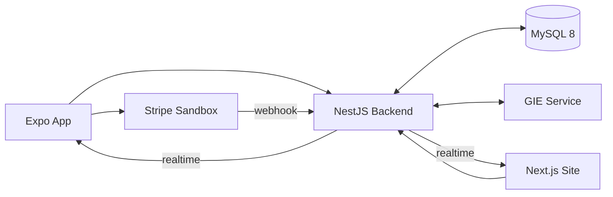

# EMPS — Energy Management and Payment Solution

EMPS is a development ecosystem for EV charging, energy management and sandbox payments. It combines a React Native/Expo driver app, a Next.js operations site, a NestJS API, MySQL 8 and the GIE energy-management service.

> This repository is a demonstrative prototype. Energy is simulated when physical hardware is unavailable, GIE NORMAL combines demonstrative demand with weather/fallback data, and Stripe runs only in Sandbox. No real financial transaction occurs. ESP32/OCPP hardware integration remains future work.

## Architecture



- `app/emps-charge`: driver app, QR, charging sessions, PaymentSheet and receipts.
- `site/emps-site-main/frontend`: administrative and operational web interface.
- `site/emps-site-main/backend`: authentication, stations, chargers, sessions, billing, payments, realtime and GIE adapter.
- `site/emps-site-main/database`: official MySQL schema. It contains structure only, never the original development dump.
- `gie/GIE`: forecasts, MPC, load balancing, NORMAL, Presentation and Manual Demo.
- `scripts`: safe setup/start/stop/environment wrappers.
- `docs`: architecture and team handoff documentation.

## Quick start on Windows

Requirements: Docker Desktop, Node.js/npm, Python 3.12 and PowerShell.

```powershell
git clone https://github.com/TommasoNagliatti/EMPS-Ecosystem.git
cd EMPS-Ecosystem
.\scripts\setup-local.ps1
.\scripts\start-local.ps1
```

The setup installs dependencies and creates local `.env` files only when they do not already exist. The startup keeps the terminal open and preserves the MySQL volume.

| Service | URL |
|---|---|
| Site | http://localhost:3000 |
| Backend | http://localhost:3001 |
| Health | http://localhost:3001/auth/health |
| GIE | http://localhost:8510 |
| Expo | shown by Metro, normally `exp://LAN_IP:8081` |

For a physical phone, set `EXPO_PUBLIC_EMPS_API_URL=http://YOUR_LAN_IP:3001` in `app/emps-charge/.env`. The startup script prints the detected IPv4. See [STARTUP.md](STARTUP.md) for database initialization, demo data and troubleshooting.

## Billing and payments

The current tariff is `SP_ENEL_PROTO_V1`: R$ 1.99/kWh base, R$ 0.20/kWh network addition, R$ 0.10/kWh high-demand addition, and R$ 2.29/kWh cap. Parking has a 15-minute grace period, then R$ 0.25 per started minute capped at R$ 20.00. The backend freezes the billing breakdown in `billing_snapshot` and records `tariff_version`.

`PAYMENT_PROVIDER=sandbox` is the default and requires no external credentials. Stripe is optional: use only your own test-mode keys in ignored local `.env` files and follow [docs/STRIPE_SANDBOX.md](docs/STRIPE_SANDBOX.md).

## Tests

```powershell
cd site\emps-site-main\backend; npm run check
cd ..\frontend; npm run build; npm run test:energy
cd ..\..\..\app\emps-charge; npm run check
cd ..\..\gie\GIE; .\.venv\Scripts\python.exe -m pytest tests\service
```

See [ARCHITECTURE.md](ARCHITECTURE.md), [CONTRIBUTING.md](CONTRIBUTING.md), [SECURITY.md](SECURITY.md), and [docs/GITHUB_HANDOFF.md](docs/GITHUB_HANDOFF.md).

## Limitations

- Physical EVSE, ESP32 and production OCPP adapters are not included.
- GIE and charger telemetry are demonstrative without installed hardware.
- Stripe is test mode only and the local sandbox gateway is the default.
- Models and simulations require site-specific validation before real deployment.
- Licensing for the combined ecosystem must be confirmed by the project owners before third-party redistribution.
