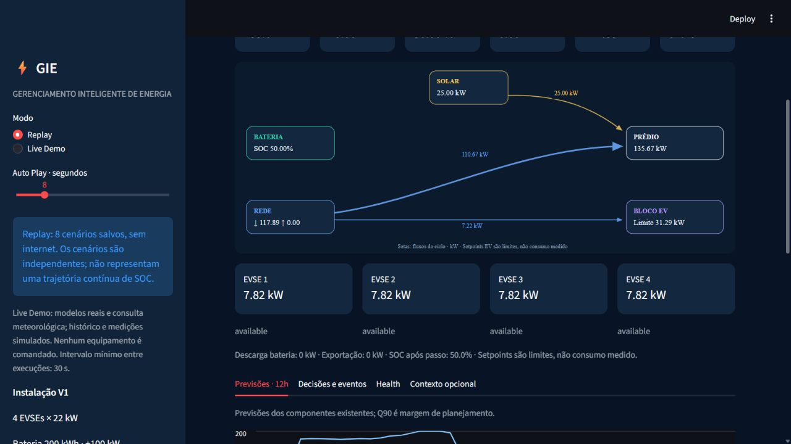
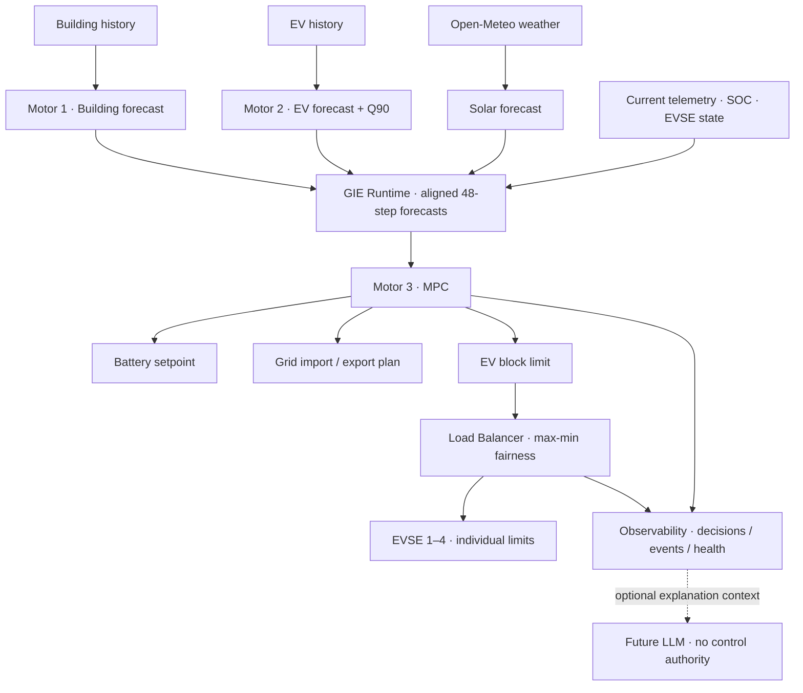
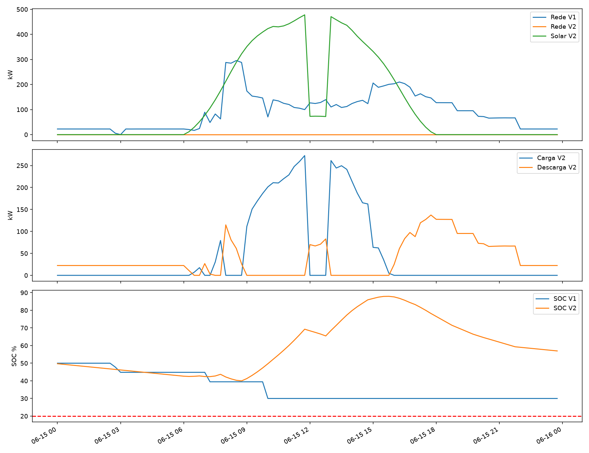
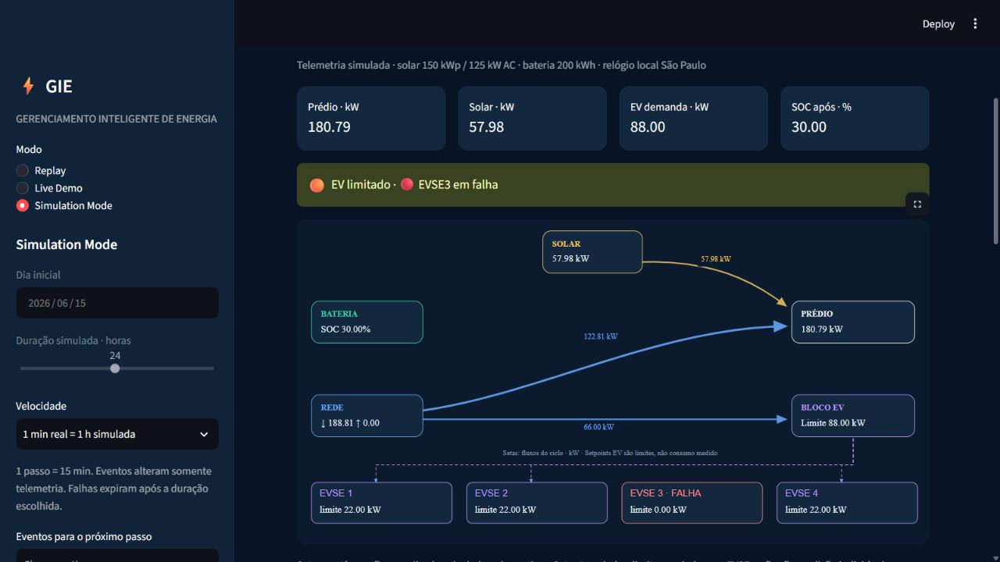
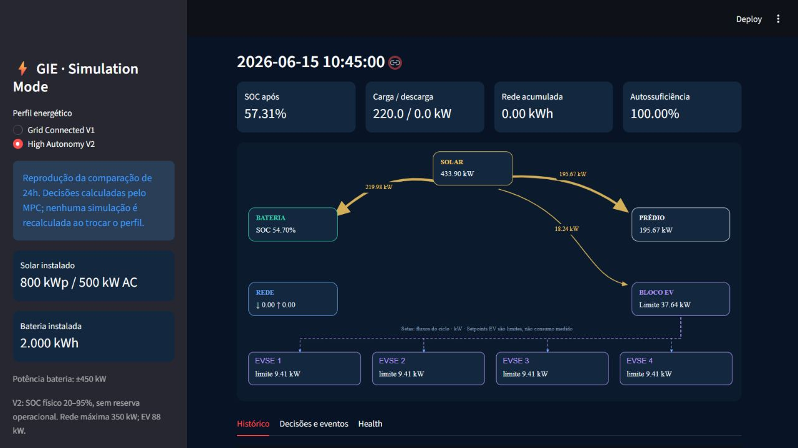
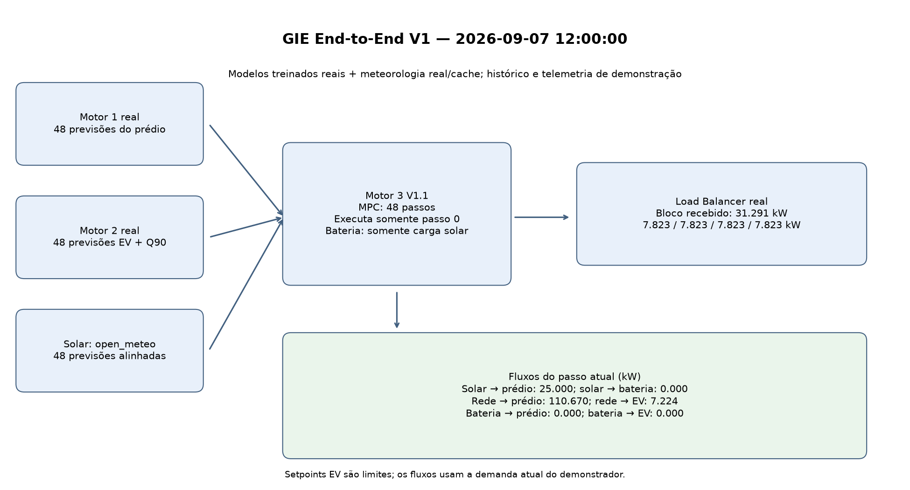
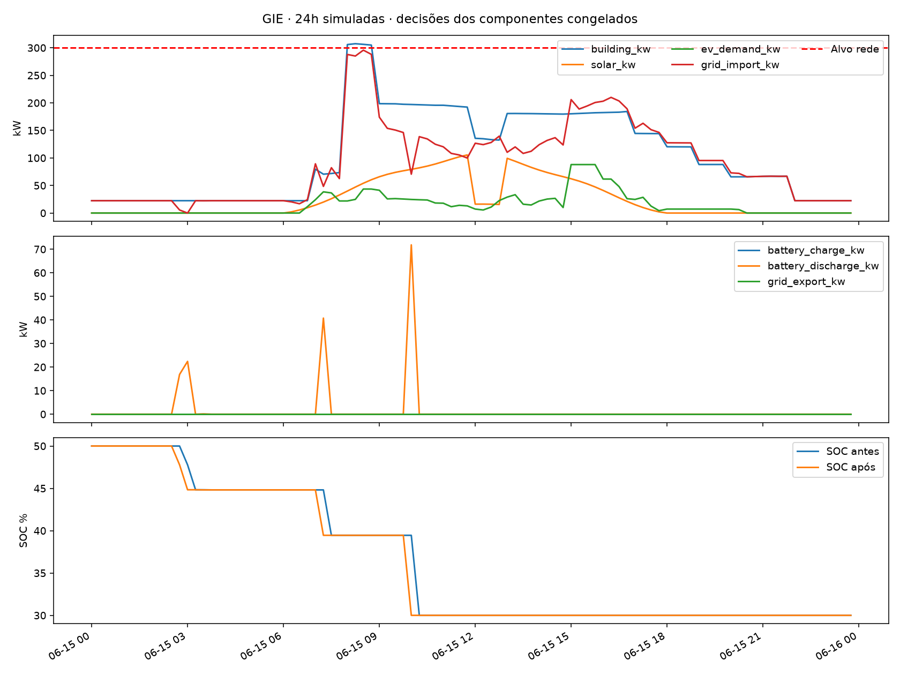

# GIE — Intelligent Energy Management
### Gerenciamento Inteligente de Energia

[English](#english) · [Português](#portugues) · [Demo](#running-the-demo) · [Results](#measured-results) · [Reproducibility](docs/REPRODUCIBILITY.md)

**Forecast the next 12 hours. Optimize energy flows. Execute one safe, observable step at a time.**

Machine Learning · Time-Series Forecasting · Model Predictive Control · Energy Management · EV Charging · Battery Storage · Solar Forecasting



<a id="english"></a>
## English

GIE is an independent, locally executed energy-management prototype for a commercial building with solar generation, battery storage and EV chargers. It connects probabilistic demand forecasts to constrained optimization and individual charging allocations, with a traceable decision every 15 minutes.

This repository is the GIE engineering project. It does not implement the GoodWe backend, commercial authentication, users, billing, payments or its frontend. The optional dashboard demonstrates the energy system.

### Architecture

**Machine Learning predicts what is likely to happen. MPC decides what to do. The Load Balancer executes the EV power allocation.**

| Component | Responsibility |
|---|---|
| Motor 1 | Building power forecast: 48 future 15-minute intervals; frozen hybrid models selected by horizon. |
| Motor 2 | EV power, occupancy, arrivals, queue, queue risk and an operational upper/Q90 power forecast. |
| Solar Forecast | Open-Meteo irradiance converted to predicted solar generation, with cache/fallback status. |
| Motor 3 | Linear MPC for battery, grid and EV-block decisions under physical constraints. |
| Load Balancer | Max-min fair allocation across four EVSEs, each capped at 22 kW, with unused capacity redistributed. |
| GIE Runtime | Validates inputs and aligned horizons, orchestrates existing components and returns one structured cycle. |
| Observability | Decision Trace, numerical reason codes, persistent events, health and compact optional `llm_context`. |
| Simulation Mode | Removable accelerated demo: synthetic telemetry feeds the existing runtime. |



Setpoints are simulated/software outputs; physical hardware adapters are not implemented.

### Why MPC replaced an LLM in Motor 3

The initial idea was to use an AI/LLM to make energy-management decisions. GIE instead uses mathematical optimization in its operational decision loop:

- Local execution with no LLM token charges or LLM API dependency.
- Low latency and reproducible decisions for fixed inputs, settings and solver.
- Explicit power, SOC and energy-conservation constraints in the optimization model.
- Inspectable objectives, solver status and a new decision every 15 minutes.

These properties make decisions easier to validate and safer to integrate. Constraint guarantees apply to feasible model solutions within numerical tolerances and valid telemetry; they do not replace BMS, electrical protection or commissioning.

**Motor 1 + Motor 2 = ML / forecasting. Motor 3 = optimization / decision making. LLM = optional explanation layer.** No LLM controls the system or is called by the decision loop. A future explanation service may read only relevant events and Decision Trace.

### One 15-minute cycle

1. Receive current measurements and available history.
2. Motor 1 forecasts building demand for 48 steps.
3. Motor 2 forecasts EV demand and operational uncertainty for 48 steps.
4. Solar Forecast supplies 48 aligned solar predictions.
5. MPC plans the next 12 hours using current measurements for execution.
6. Apply **only the first decision**.
7. Load Balancer distributes the EV-block allowance across EVSEs.
8. Record flows, events, Decision Trace and component health.
9. Repeat with new measurements 15 minutes later.

This is a **receding horizon**: the plan moves forward and is recalculated rather than executing 12 hours blindly. The operational EV demand can exceed its forecast; Q90 is planning headroom, not a rigid ceiling on realized demand.

### Site profiles

Profiles describe equipment, location, physical limits and policy. Each real installation will need its own Motor 1/2 models and data; MPC, runtime and load balancing remain reusable where their contracts apply.

| Parameter | Grid Connected V1 | Commercial High Autonomy V2 |
|---|---:|---:|
| Solar DC / inverter AC | 150 kWp / 125 kW | 800 kWp / 500 kW |
| Battery capacity | 200 kWh | 2,000 kWh |
| Battery charge / discharge | ±100 kW | ±450 kW |
| Physical SOC | 20–95% | 20–95% |
| Operational reserve | 30% | None |
| Grid import maximum | 350 kW | 350 kW |
| Export maximum | 150 kW | 500 kW |
| EV block | 4 × 22 kW = 88 kW | 4 × 22 kW = 88 kW |

V1 remains in the original configuration and dashboard; [V2 has a separate profile](site_profiles/Commercial_HighAutonomy_V2.json) and implementation. V2 prioritizes EV service and total imported kWh, has no strategic SOC reserve or material cycling penalty, and charges only from surplus solar. Battery throughput is used only to break otherwise equivalent solutions. Excess solar is exported when storage cannot accept it.

These are **simulation/prototype profiles**, not an electrical construction design. [Policy details](docs/HIGH_AUTONOMY_V2.md) · [Site profiles](docs/SITE_PROFILES.md).

<a id="measured-results"></a>
### Measured results

All numbers below come from saved reports; no models were retrained for presentation.

| Evaluation | Confirmed result | Evidence |
|---|---|---|
| Motor 1 frozen July temporal test | Hybrid MAE **7.33 kW**, RMSE **15.24 kW**, WAPE **8.45%**; +12h MAE **9.31 kW** | [Aggregate](outputs/motor_consumo/julho_2026/metrics_overall.csv), [horizons](outputs/motor_consumo/julho_2026/metrics_selected_horizons.csv) |
| Motor 2 frozen July synthetic extension | Hybrid power MAE **5.50 kW**, RMSE **9.16 kW**, WAPE **50.80%** | [Power](outputs/motor_carregadores/teste_final_julho_2026/metrics_power_overall.csv) |
| Motor 2 occupancy / arrivals / queue | MAE **0.415 / 0.283 / 0.301 vehicles** | [Counts](outputs/motor_carregadores/teste_final_julho_2026/metrics_counts.csv) |
| Motor 2 queue risk | PR-AUC **0.805**, ROC-AUC **0.952**, Brier **0.0715**, threshold **0.16** | [Risk](outputs/motor_carregadores/teste_final_julho_2026/metrics_risk.json) |
| Motor 2 operational upper / raw Q90 | Coverage **91.27% / 91.12%** | [Coverage](outputs/motor_carregadores/teste_final_julho_2026/metrics_q90.json) |
| Motor 3 V1 execution revision, saved 48h run | Mean solver **5.72 ms**; maximum balance residual **5.68 × 10⁻¹⁴ kW** | [Revision-specific report](outputs/motor_gerenciamento/v1_rev1/integrated_summary.json) |
| End-to-end saved cycle | **2.78 s**, including weather; loading models recorded separately at **0.90 s** | [Runtime report](outputs/gie_runtime/v1/summary.json) |
| Load Balancer | **24 tests**; fair allocation, redistribution, 22 kW individual ceiling | [Design/tests](docs/LOAD_BALANCER_V1.md) |

July is held out from model fitting and selection, but remains synthetic—not evidence of real-site performance. EV July extends June's monthly parameters (arrival factor 1.03, peak shift −0.03 hour), preregistered before generation. The operational upper is `max(point prediction, bounded raw Q90)`; coverage for both is reported, not calibrated on July. Solver timings are specific to the recorded revision and machine, not a universal performance promise.

### High Autonomy: same 24-hour scenario

| Metric | V1 | V2 |
|---|---:|---:|
| Imported energy | 2,214.78 kWh | 0.00 kWh |
| Self-sufficiency | 22.55% | 100.00% |
| Generated solar | 606.75 kWh | 3,101.20 kWh |
| SOC minimum / maximum / final | 30 / 50 / 30% | 39.97 / 87.92 / 56.95% |
| Battery charge / discharge energy | 0 / 38 kWh | 1,123.75 / 882.08 kWh |
| Solar exported | 0 kWh | 0 kWh |
| Unserved EV energy | 16.50 kWh | 16.50 kWh |

[Saved metrics](outputs/high_autonomy_v2/comparison/metrics.json). Same building/EV measurements, forecasts and events; PV sizing and battery/policy change. Both start at 50% SOC, which means **100 versus 1,000 kWh initially stored**. This comparison does not isolate policy alone or establish annual autonomy. Self-sufficiency is `1 − grid_import / (building_energy + served_EV_energy)`. The remaining EV shortfall reflects EVSE unavailability.



<a id="running-the-demo"></a>
### Running the Demo

Windows, from the repository root:
```powershell
py -3.12 -m venv .venv
.\.venv\Scripts\python.exe -m pip install -r requirements.txt
py -3.12 -m venv .venv-demo
.\.venv-demo\Scripts\python.exe -m pip install -r requirements-demo.txt
.\run_demo.bat
# Separate V1 / V2 saved comparison:
.\run_high_autonomy_v2.bat
```

| Mode | What runs |
|---|---|
| Replay | Offline saved scenarios; no internet or model inference required. |
| Live Demo | Trained engines + runtime + weather/cache/fallback, with demonstrative telemetry. |
| Simulation Mode | Accelerated 15-minute cycles with continuous SOC, events and existing core decisions. |
| High Autonomy launcher | Saved V1/V2 comparison playback, selectable without recomputing results. |

Simulation speed includes **one real minute = one simulated hour**. The UI is optional: removing it does not change core inference or control. Core execution needs no Streamlit. [Full setup and generation guide](docs/REPRODUCIBILITY.md).




### Project structure

```text
GIE/
├── src/
│   ├── motor_consumo/          # building V2 + preserved v1/
│   ├── motor_carregadores/     # EV V1
│   ├── motor_carregadores_v2/  # hybrid power + Q90
│   ├── motor_gerenciamento/    # original MPC
│   ├── motor_gerenciamento_v2/ # isolated High Autonomy policy
│   ├── load_balancer/
│   ├── integracoes/            # weather + solar
│   ├── gie_runtime/
│   └── observabilidade/
├── models/                    # frozen trained references
├── data/                      # three official synthetic CSVs
├── site_profiles/
├── demo/                      # optional UI and simulation
├── simulacao/                 # EnergyPlus / EV generators
├── tests/
├── tools/                     # portable release checks
├── docs/                      # specifications, assets, evidence
├── outputs/                   # curated metrics and replay fixtures
├── requirements.txt
├── requirements-demo.txt
└── LICENSE_NOTICE.md
```

### Tests and technologies

```powershell
.\.venv\Scripts\python.exe -B tools/run_tests.py
.\.venv-demo\Scripts\python.exe -B tools/run_tests.py --demo
```

**Release validation: 169 tests passed, 3 historical snapshot checks explicitly skipped, 0 failures.** The report records each suite: [validation](docs/release/validation.json). Coverage includes causal forecast features, optimization, physical bounds, energy conservation, EVSE fairness, failure states, offline replay, serialization and dashboard controls. Three local historical-snapshot checks are explicitly excluded by the portable runner; a release SHA-256 manifest verifies frozen files instead.

Used here: **Python, LightGBM, NumPy, Pandas, SciPy/HiGHS, Matplotlib, Pillow, Streamlit, Open-Meteo, EnergyPlus and OpenStudio**. Dependencies are pinned in the two requirements files. The UI uses SVG and Streamlit charts; architecture documentation uses Mermaid. No scikit-learn or LLM package is required by the current core.

### Limitations and future hardware

- Main datasets are synthetic: EnergyPlus for the building and simulated EV sessions.
- The weather file is a typical meteorological year, not observed 2026 weather.
- Real-building accuracy, safety and operation still require real-site validation.
- High Autonomy is a prototype scenario, not a commissioned installation.
- No inverter, BMS or physical EVSE integration has been implemented.
- Free Open-Meteo access has its own [usage terms](https://open-meteo.com/en/terms); consult them for the intended deployment.
- Software feasibility depends on measurements and assumptions; hardware protections remain necessary.

[Hardware integration](docs/HARDWARE_INTEGRATION.md) defines `InverterAdapter`, `MeterAdapter` and `EVSEAdapter`: timestamped telemetry with quality/freshness, command ACK, expiry/timeout, readback confirmation and communication-loss behavior. Future implementations may use Modbus TCP/RTU, OCPP or manufacturer APIs, depending on the equipment. Protocols remain outside the core.




### Roadmap and license

**Completed:** building/EV forecasting, MPC, load balancing, solar forecast, runtime, observability, demo and site profiles.

**Next:** physical hardware adapters, real-site datasets, multi-site validation, deployment interfaces and an optional LLM explanation service.

**License pending author selection.** See [LICENSE_NOTICE.md](LICENSE_NOTICE.md); no open-source license has been silently assigned. [Manual GitHub publication](docs/PUBLISHING.md).

---

<a id="portugues"></a>
## Português

**Prever as próximas 12 horas. Otimizar fluxos de energia. Executar um passo observável a cada ciclo.**

O GIE é um protótipo independente de gerenciamento energético executado localmente. Combina Machine Learning, previsão de séries temporais, MPC, carregamento de veículos elétricos, armazenamento em bateria e previsão solar para um prédio comercial.

O projeto não é o backend da GoodWe e não implementa pagamentos, cobrança, usuários, autenticação comercial ou frontend da GoodWe. O dashboard é uma demonstração opcional do sistema energético.

### Arquitetura e responsabilidades

**Machine Learning prevê o que pode acontecer. O MPC decide o que fazer. O Load Balancer distribui a potência EV autorizada.**

- **Motor 1:** previsão de consumo do prédio em 48 intervalos futuros de 15 minutos.
- **Motor 2:** potência EV, ocupação, chegadas, fila, risco de fila e potência alta/Q90.
- **Solar Forecast:** irradiância da Open-Meteo convertida em geração solar, com cache/fallback identificados.
- **Motor 3:** otimização linear de bateria, rede e bloco EV.
- **Load Balancer:** divisão max-min justa entre quatro EVSEs, com redistribuição de sobras e limite individual de 22 kW.
- **Runtime:** valida entradas, alinha horizontes e conecta os componentes existentes.
- **Observabilidade:** Decision Trace, códigos de motivo, eventos, health e `llm_context` compacto.
- **Simulation Mode:** telemetria sintética e reprodução acelerada, sem reimplementar decisões.

O diagrama acima mostra as relações entre os módulos. As saídas representam decisões e setpoints de software; não comandam equipamentos físicos nesta versão.

### Por que o Motor 3 passou de LLM para MPC

A ideia inicial de decisão por IA/LLM foi substituída pelo Model Predictive Control para obter execução local, ausência de custo de tokens no ciclo operacional, menor latência, comportamento reproduzível e restrições físicas explícitas.

As equações limitam potência, SOC e balanço energético; o solver e suas falhas são observáveis. As garantias matemáticas se aplicam ao modelo viável, às tolerâncias numéricas e às medições válidas. Não substituem BMS, proteções elétricas ou comissionamento.

**Motores 1 e 2 = previsão por ML. Motor 3 = otimização e decisão. LLM = explicação opcional.** Nenhuma LLM controla ou é chamada pelo ciclo. Uma camada futura poderá consumir apenas eventos e Decision Trace para explicações humanas.

### Ciclo de 15 minutos

Entram novas medições e históricos disponíveis; os Motores 1 e 2 geram 48 previsões, a previsão solar fornece os mesmos timestamps e o MPC planeja 12 horas. Somente a primeira decisão é aplicada. O Load Balancer distribui a potência EV e os fluxos, eventos e health são registrados. Quinze minutos depois tudo é recalculado.

Esse **horizonte deslizante** adapta o plano às novas medições. Q90 serve como margem de planejamento: não impede atender demanda EV real maior quando houver capacidade segura.

### Perfis de instalação

| Configuração | Grid Connected V1 | High Autonomy V2 |
|---|---:|---:|
| Solar / inversor | 150 kWp / 125 kW | 800 kWp / 500 kW |
| Bateria / potência | 200 kWh / ±100 kW | 2.000 kWh / ±450 kW |
| SOC físico | 20–95% | 20–95% |
| Reserva operacional | 30% | Nenhuma |
| Rede máxima / exportação máxima | 350 / 150 kW | 350 / 500 kW |
| Bloco EV | 88 kW | 88 kW |

Os perfis alteram configuração física e política, reutilizando a arquitetura. Cada instalação real precisará de identificação de equipamentos, localização, configuração e modelos dos Motores 1/2 próprios.

A V2 fica separada da V1, não possui reserva estratégica nem penalização relevante de ciclagem, minimiza importação e carrega a bateria apenas com excedente solar. O pequeno desempate de throughput não pode sacrificar as prioridades anteriores. São cenários de protótipo, não projetos elétricos executivos. [Detalhes](docs/HIGH_AUTONOMY_V2.md).

### Resultados confirmados

| Avaliação salva | Resultado |
|---|---|
| Motor 1, julho congelado | MAE 7,33 kW; RMSE 15,24 kW; WAPE 8,45%; MAE em +12h: 9,31 kW |
| Motor 2, potência de julho | MAE 5,50 kW; RMSE 9,16 kW; WAPE 50,80% |
| Ocupação / chegadas / fila | MAE 0,415 / 0,283 / 0,301 veículos |
| Risco de fila | PR-AUC 0,805; ROC-AUC 0,952; Brier 0,0715; threshold 0,16 |
| Cobertura alta operacional / Q90 bruto | 91,27% / 91,12% |
| Motor 3, revisão de execução, integração salva de 48h | Solver médio 5,72 ms; resíduo máximo de balanço 5,68 × 10⁻¹⁴ kW |
| Ciclo end-to-end salvo | 2,78 s; carregamento inicial dos modelos separado: 0,90 s |
| Load Balancer | 24 testes de limites, redistribuição e justiça |

As fontes estão na [tabela de evidências](#measured-results). Julho não foi usado para ajustar modelos ou seletores. Continua sendo um teste **sintético**, não uma validação em prédio real. Para EVs, julho herdou os parâmetros mensais de junho (1,03 e −0,03 hora), registrados antes da geração. A potência alta operacional é o máximo entre a previsão pontual e o Q90 limitado; ambas as coberturas são reportadas.

Na comparação de 24h, a importação caiu de **2.214,78 para 0,00 kWh** e a autossuficiência passou de **22,55% para 100%**. Na V2, SOC mínimo/máximo/final: **39,97% / 87,92% / 56,95%**; carga/descarga: **1.123,75 / 882,08 kWh**. Nenhum perfil exportou solar; ambos tiveram **16,50 kWh** EV não atendidos por indisponibilidade de EVSE.

A comparação muda dimensionamento e política. SOC inicial de 50% equivale a 100 kWh na V1 e 1.000 kWh na V2; portanto, não isola o efeito da política nem demonstra autonomia anual. Autossuficiência usa energia importada em relação ao consumo do prédio mais EV atendido.

### Executando a demo e os testes

Use os comandos da seção [Running the Demo](#running-the-demo), a partir da raiz do projeto. Eles criam `.venv` para o core e `.venv-demo` para Streamlit, com instalação explícita de dependências.

- `run_demo.bat`: **Replay** offline, **Live Demo** com componentes existentes e **Simulation Mode** acelerado.
- `run_high_autonomy_v2.bat`: comparação V1/V2 salva, sem recalcular ao trocar perfil.
- `.venv\Scripts\python.exe -B tools/run_tests.py`: testes do core e simulação.
- `.venv-demo\Scripts\python.exe -B tools/run_tests.py --demo`: testes do dashboard.

A velocidade principal é um minuto real para uma hora simulada. Live Demo usa telemetria demonstrativa; não é operação física. A parte visual é removível e o core não importa Streamlit.

**Validação: 169 testes aprovados, 3 verificações históricas explicitamente separadas, nenhuma falha.** Os detalhes estão no [relatório da publicação](docs/release/validation.json). Três verificações de snapshots históricos locais são explicitamente separadas; o manifesto da publicação confere os arquivos congelados. [Reprodução e geração dos artefatos](docs/REPRODUCIBILITY.md).

### Tecnologias, limitações e hardware futuro

Tecnologias usadas: Python, LightGBM, Pandas, NumPy, SciPy/HiGHS, Matplotlib, Pillow, Streamlit, Open-Meteo, EnergyPlus e OpenStudio.

Os dados principais ainda são sintéticos: prédio via EnergyPlus e sessões EV simuladas. O arquivo climático representa um ano meteorológico típico, não medições de 2026. O desempenho e a segurança em instalações reais precisam de validação própria. High Autonomy é um protótipo; inversor, BMS e EVSEs físicos ainda não foram integrados. A Open-Meteo gratuita possui [condições próprias de uso](https://open-meteo.com/en/terms).

[HARDWARE_INTEGRATION.md](docs/HARDWARE_INTEGRATION.md) especifica InverterAdapter, MeterAdapter e EVSEAdapter, incluindo timestamps, qualidade/freshness, ACK, timeout, validade e confirmação posterior dos setpoints. Modbus TCP/RTU, OCPP ou APIs de fabricantes poderão ser usados conforme o equipamento; o core permanece independente do protocolo.

### Roadmap e licença

**Concluído:** previsões do prédio e EV, MPC, Load Balancer, previsão solar, runtime, observabilidade, demo e perfis.

**Próximas etapas:** adaptadores físicos, dados reais, validação em múltiplos locais, interfaces de implantação e explicação opcional por LLM.

**Licença pendente de escolha do autor.** Consulte [LICENSE_NOTICE.md](LICENSE_NOTICE.md). Nenhuma licença definitiva foi escolhida automaticamente. [Publicação manual no GitHub Desktop](docs/PUBLISHING.md).


## Presentation e integração V1

Execute `run_high_autonomy_v2.bat` (porta 8503) e selecione **Presentation** ou **Manual Demo**.
A comparação V1/V2 foi preservada. São 16 cenas offline validadas, autoplay 5/10/15s,
mensagens determinísticas e estado visual para futura maquete, sem LLM ou hardware.
`gie_control.GIEControl` oferece a interface Python para backend futuro.
Gere o pacote com `.venv\Scripts\python.exe -B tools\build_integration_bundle.py`.
Consulte [Presentation](docs/PRESENTATION_MODE.md), [API](docs/GIE_CONTROL_INTERFACE.md),
[Maquete](docs/MAQUETTE_INTERFACE.md) e [Bundle](docs/INTEGRATION_BUNDLE.md).
